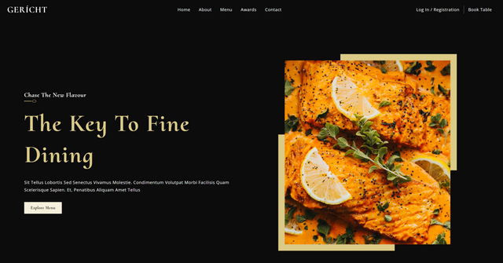

# Restaurant Landing Page

A fully functional restaurant landing page website I made using a modern UI/UX design on Figma.
This design can be used for any high-end restaurant client to serve their needs.


## Deployment
Visit the fully deployed website [here](https://shadowowl888.github.io/restaurant-website/).

## Features

- Modern UI/UX design
- Descriptive about us section
- High-quality media images
- Photo gallery carousel
- Newsletter signup
- Cross platform
- Mobile device optimization


## Tech Stack

**Client:** HTML, CSS, Javascript, React

**Server:** Node, Express


## Installation

Install restaurant-website with npm

```bash
  npm install restaurant-website
  cd my-project
```
    
## Roadmap
### Front-End
- Link buttons to more pages
- Improve customer user support
- Expand to more pages

### Internal
- Add more integrations
- Possible API backend
## Lessons Learned

The hardest part and most complex part of the project was working with the React components of the restaurant website. Difficult to understand the depth of React and adapting from the Figma UI/UX design to code. Managed the website through making smaller components and a time, making the project more modular and have cleaner code. While I spent some time thinking about the design, majority of the components in this project became obvious after working and testing with them.

I now understand that it is best to keep larger projects more modular so that parts of your code is readable and easy to underrstand. In this way, it was easy to find the problem and fix what was needed to correlate with the design. Likewise trial, error, and testing were crucial parts of this project to be able to make changes to align with the design.

In all things considered, this was a great project and included a lot of lessons that was learned.
## Contact
Feel free to contact me at Shadowowl ☆#3300 on Discord
